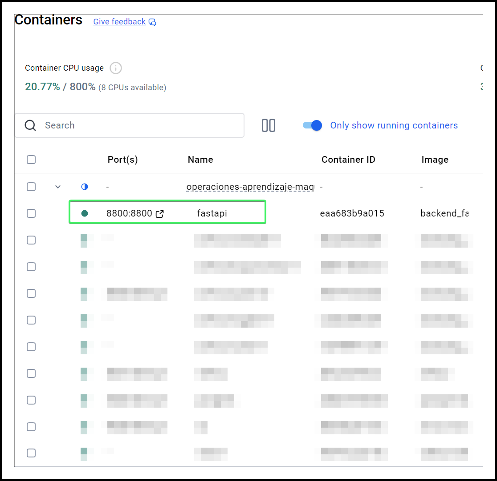

# Operaciones de Aprendizaje de Máquina

## Integrantes

- Acevedo Zain, Gaspar (acevedo.zain.gaspar@gmail.com)
- Chunga, Juan Miguel (juanmiguel.ch2014@gmail.com)
- Gonzalez, Juan (juan.gonzalez.working@gmail.com)
- Lauro, Rodrigo (ing.rodrigo.lauro@gmail.com)
- Rodrigues da Cruz, Nicolás (Nicolasrdc151@gmail.com)

## Descripción

Implementación de un modelo de Machine Learning basado en el [Body Fat Prediction Dataset](https://www.kaggle.com/datasets/fedesoriano/body-fat-prediction-dataset) en un entorno productivo simulado con **Docker Compose**.  
El objetivo es desplegar y orquestar un pipeline de MLOps con los siguientes servicios:

- **Apache Airflow**: orquestación de flujos de trabajo (DAGs de entrenamiento y predicción).
- **MLflow**: gestión del ciclo de vida de modelos (tracking, versionado y registro).
- **FastAPI**: servicio REST para exponer el modelo entrenado.
- **MinIO (S3 compatible)**: almacenamiento de datasets y artefactos de modelos.
- **PostgreSQL**: base de datos backend para MLflow y Airflow.
- **Valkey (Redis fork)**: backend para ejecución distribuida de Airflow.

***DAGs*** de Airflow

- `dag_bodyfat_pipeline`: se encuentra definido en [/airflow/dags/dag_pipeline.py](./airflow/dags/dag_pipeline.py), y su propósito es realizar el preprocesamiento del `BodyFat` dataset (ver [/data/external/bodyfat.csv](/data/external/bodyfat.csv)), entrenar un modelo de machine learning, evaluar el modelo de machine learning, y promover dicho modelo mediante `MLFLow` a producción.

***REST API***

- Configurada mediante *FastAPI*, se encuentra definida en [/dockerfiles/fastapi/app.py](/dockerfiles/fastapi/app.py),
- Posee dos endpoints:
  - `GET` `<host>:<port>/`: el cual consiste en un *welcome message* a fin de testear rápidamente la API.
  - `POST` `<host>:<port>/predict`: el cual permite realizar predicciones utilizando el modelo productivo de `MLFLow`, en función de los datos enviados en el *body*.

En la sección `Realizar predicciones mediante REST API` se encuentran los pasos necesarios para probar estos endpoints mediante [Postman](https://www.postman.com/).

## Guía - ¿Cómo ejecutar y testear la aplicación?

### Pre-requisitos

1. `git` para clonar el repositorio.
1. `docker` o [docker desktop](https://docs.docker.com/desktop/), para ejecutar la aplicación localmente.
1. [Postman](https://www.postman.com/) para testear la REST API.

### Step-by-step guide

#### Clonado del repositorio

En esta sección se explican los pasos necesarios para clonar el repositorio:

1. Clonar el repositorio con el siguiente comando:
   1. `git clone https://github.com/gasper-az/operaciones-aprendizaje-maquina.git`.
1. Ubicarse en la raíz del directorio del repositorio:
   1. `cd operaciones-aprendizaje-maquina`.
1. (opcional) En el caso que exista, borrar en la carpeta `airflow/dags` la subcarpeta `__pycache__`.

#### Creación de imágenes, volúmenes y contenedores mediante docker compose

En esta sección se explican los pasos necesarios para crear las imágenes de docker mediante docker-compose, como así también para crear los containers que se utilizarán en pasos posteriores:

1. Inicializar el servicio de `docker` o `docker desktop` en el sistema.
1. Ubicarse en la raíz del directorio del repositorio:
   1. `cd operaciones-aprendizaje-maquina`.
1. Ejecutar los siguientes comandos de `docker`:
   1. (recomendado) `docker compose down -v`
      1. Este comando asegura que, en caso de existir, se detengan los servicios de docker compose.
   1. (recomendado) `docker system prune -af --volumes`
      1. Este comando asegura que, en caso de existir, se eliminen los volúmenes utilizados por docker.
   1. `docker compose build --no-cache`
      1. Este comando fuerza el *build* de las imágenes necesarias, independientemente de si existen en el sistema o no.
      1. Al haber varias imágenes involucradas, la ejecución suele demorar varios minutos.
   1. `docker compose up`
      1. Este comando crea los *containers* de docker a partir de las imágenes creadas en el paso anterior.

#### Preprocesamiento de dataset y entrenamiento de modelo

En esta sección se explica cómo ejecutar el `DAG` de Airflow que se encarga de preprocesar el dataset, como así también de entrenar y evaluar un modelo de Machine Learning que será posteriromente *promovido* a producción.

1. Asegurarse que el servicio de `airflow-apiserver` está siendo ejecutado correctamente desde docker (o docker desktop).


2. Ir al sitio de `Airflow` hosteado localmente en http://localhost:8080/
3. Loguearse utilizando las credenciales configuradas en el archivo `.env`:
   - `Usuario`: valor de `_AIRFLOW_WWW_USER_USERNAME`
   - `Password`: valor de `_AIRFLOW_WWW_USER_USERNAME`
4. En la sección de `Dags` seleccionar el dag de `dag_bodyfat_pipeline`:


5. Ejecutar el pipeline mediante el botón `trigger`, y esperar a que éste finalice correctamente:


6. (opcional) Validar que todos los steps/tasks del pipeline se hayan ejecutado correctamente:


> Una vez ejecutados todos estos pasos, el modelo habrá sido entrenado, evaluado y promovido a producción mediante `MLFlow`.

#### (opcional) Validar que el modelo esté registrado en MLFlow

Este es un paso opcional, que consiste en corroborar que el modelo entrenado y evaluado en el paso anterior haya sido correctamente *promovido* a `MLFlow`.

> Esta sección ***NO*** requiere la ejecución manual ni automatizada (CLI) de ningún comando.

1. Validar que el container de `MLFlow` y `S3` (`Minio`) estén ejecutándose correctamente en docker (o docker desktop):


2. Ingresar al sitio de `MLFlow` hosteado localmente en http://localhost:5001/:
3. En la sección de `Models` asegurarse que existe el modelo `body_fat_productive` con el alias/tag `champion`:


#### Realizar predicciones mediante REST API

En esta sección se detallan los pasos para utilizar la REST API mediante `POSTMAN` a fin de realizar predicciones con el modelo productivo.

Actualmente, la REST API tiene *endpoints*:

- `GET` - `<host>:<port>/`: el cual devuelve un *welcome* message, a fin de testear rápidamente la API.
- `POST` - `<host>:<port>/predict`: el cual permite realizar predicciones, utilizando el modelo deployado en MLFLow.

Para probar ambos casos, es necesario primero asegurarse que el servicio de `fastapi` está siendo ejecutado en docker (o docker desktop):



Para probar ambos endpoints se recomienda el uso de `POSTMAN`.

En cuanto al `<host>` y `<port>`, estos son:

- `<host>`: `127.0.0.1` o `localhost`.
- `<port>`: valor configurado en el archivo `.env`, en la variable `FASTAPI_PORT` (por defecto es `8800`).

##### `GET` method

1. En postman, crear un nuevo *request* del tipo `GET`.
1. En la *url* poner `http://127.0.0.1:8800`.
1. Utilizar los *headers* por defecto.
1. ***NO*** es necesario utilizar Body.
1. Enviar el request mediante el botón `send`.
1. El resultado será igual al que se muestra en la siguiente imagen:


##### `POST` method

1. En postman, crear un nuevo *request* del tipo `POST`.
1. En la *url* poner `http://127.0.0.1:8800/predict/`.
1. En la sección de `headers`, agregar un nuevo registro con *key* `Accept` y *value* `application/json`.
1. Configurar un `body` similar al siguiente (en postman, seleccionar el tipo `raw`):

```JSON
{
    "features": {
        "density": 1.0708,
        "age": 23,
        "weight": 154.25,
        "height": 67.75,
        "neck": 36.2,
        "chest": 93.1,
        "abdomen": 85.2,
        "hip": 94.5,
        "thigh": 59.8,
        "knee": 37.3,
        "ankle": 24.0,
        "bicep": 32.4,
        "forearm": 26.5,
        "wrist": 16.6
    }
}
```

5. Enviar el request mediante el botón `send`.
6. El resultado será similar al que se muestra en la siguiente imagen:


### Diagrama


***Referencias***

1. Configuración inicial:
   1. **Redis** se utiliza para configurar **Airflow** al inicializar los servicios.
   1. **PostgreSQL** se utiliza para configurar **Airflow** y **MLFlow** al inicializar los servicios.
1. **Apache Airflow** - ejecución del *DAG*:
   1. Se ejecuta el *DAG* de `dag_bodyfat_pipeline` manualmente.
   1. Se preprocesa el dataset de `BodyFat`.
1. **Apache Airflow** guarda el dataset procesado de *BodyFat* en **s3**.
   1. En el bucket de `s3://data` se guardan los datasets de *train* y *test*.
1. Mediante **MLFlow** se consume el dataset desde **s3** con el fin de generar un modelo de *Machine Learning*.
1. Una vez generado el modelo, **MLFlow** lo guarda en **s3**.
   1. En el bucket de `s3://mlflow` se guardan los modelos entrenados, como así también los modelos productivos.
1. *Usuario Final* realiza un llamado a la **REST API** para realizar una inferencia.
   1. El endpoint en donde se expone el modelo productivo es `POST /predict`.
1. La **REST API** consume el modelo desde **s3**, realiza la inferencia, y genera un resultado para el *Usuario Final*.
1. La **REST API** le devuelve un *response* con la inferencia al *Usuario Final*.

### Entrega 1

- Servicios containerizados (*MLFlow*, *Airflow*, s3, *PostgreSQL*)
- Notebook loggeando en MLflow.
- *DAG* de procesamiento básico corriendo.
- *README* inicial.

### Entrega final

- DAG con hiperparámetros + promoción a Registry.
- Batch predict funcionando en Airflow.
- API usando modelo en Production.
- Documentación + tests básicos.

### 📂 Estructura de carpetas

```YAML
│
├── airflow/
│ ├── dags/ # DAGs de Airflow
│ │ ├── train_model_dag.py
│ │ └── batch_predict_dag.py
│ ├── logs/ # Logs (excluidos del repo)
│ └── plugins/ # Operadores y hooks personalizados
│
├── diagrams/
│
├── dockerfiles/
│   ├── airflow/
│   │   ├── Dockerfile
│   │   └── requirements.txt
│   ├── fatapi/
│   │   ├── app.py
│   │   ├── Dockerfile
│   │   └── requirements.txt
│   ├── mlflow/
│   │   ├── Dockerfile
│   │   └── requirements.txt
│   └── postgres/
│       ├── Dockerfile
│       ├── requirements.txt
│       └── mlflow.sql
│
├── images/
│
├── ml/
│ ├── eval.py
│ ├── preprocess.py
│ ├── promote_model.py
│ └── train.py
│
├── notebooks/
│ ├── body_fat_analysis.ipynb
│ └── mlflow_playground.ipynb
│
├── utilities/
│   └── scripts/
│       ├── commons.py
│       ├── constants.py
│       ├── graficos.py
│       ├── hiperparametros.py
│       ├── metricas.py
│       ├── procesamiento.py
│       └── s3.py
├── .env
├── docker-compose.yaml
├── README.md
└── requirements.txt
```

### Comandos útiles

Se listan a continuación varios comandos útiles de `docker`:

- Para correr el proyecto:
  - `docker compose up`.
  - Opcionalmente `docker compose -f docker-compose.yaml up` para espeficiar el archivo compose.
- Para hacer build de las imágenes:
  - `docker compose build`.
- Para hacer build y correr el proyecto:
  - `docker compose up --build`
- Para hacer build y forzar la recreación de containers:
  - `docker compose up --build --force-recreate`
- Para borrar los containers:
  - `docker compose down`.
  - Opcionalmente `docker compose down -v` para borrar los ***volúmenes*** creados.
- Para hacer un *clean build*:
  - ***NOTA***: esto va a volver a crear las imágenes de docker, por lo cual puede *demorar más tiempo* de lo habitual.
  - `docker compose build --no-cache`
  - `docker compose up --force-recreate`
- ***Recomendación*** - Recrear ambiente local
  - `docker compose down -v`
  - Borrar las siguientes carpetas
    - `/airflow/dags/__pycache__`
    - `/minio_data`
  - Opcional: borrar las imágenes de docker
    - Ver el siguiente [post de Stack Overflow](https://stackoverflow.com/questions/44785585/how-can-i-delete-all-local-docker-images).
  - `docker compose up --build`
